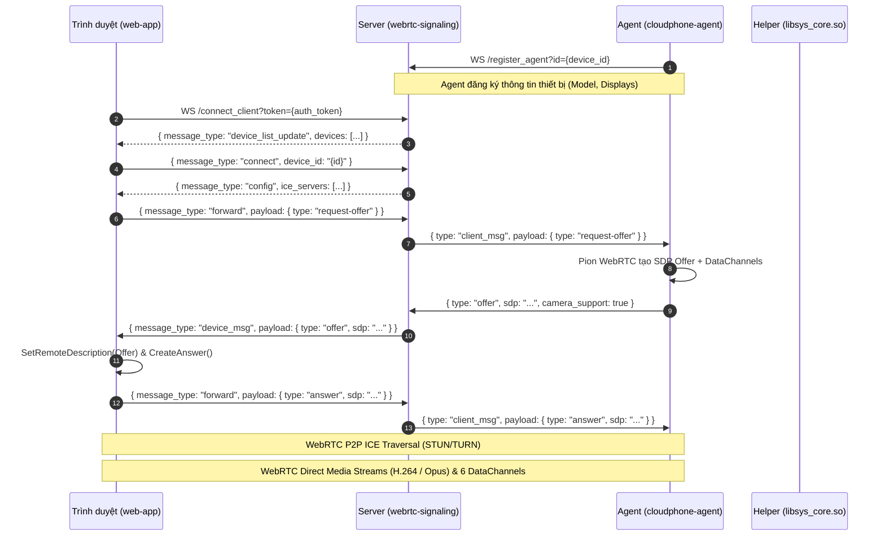

# Đặc Tả Giao Thức Hệ Thống ScrcpyOverWebRTC (v0.3.6)

Tài liệu này đặc tả chi tiết toàn bộ các tầng giao thức kết nối trong hệ thống giữa:
`Trình duyệt (web-app)` ↔ `Máy chủ tín hiệu (webrtc-signaling)` ↔ `Android Agent (cloudphone-agent)` ↔ `Android Helper (libsys_core.so / scrcpy-server)`.

---

## 1. Kiến Trúc Kết Nối Tổng Quan



---

## 2. Giao Thức WebSocket Tín Hiệu (Signaling Protocol)

### 2.1 Endpoint Agent: `/register_agent?id={device_id}`

Agent thiết lập kết nối WebSocket tới cổng tín hiệu (mặc định 8443).

#### 1. Thông báo đăng ký thiết bị (Agent → Server):
```json
{
  "action": "register",
  "info": {
    "android_model": "Pixel 7 Pro",
    "android_serial": "1234567890",
    "android_version": "14",
    "app_version": "0.3.6",
    "displays": [
      {
        "id": 0,
        "x_res": 1080,
        "y_res": 2400
      }
    ]
  }
}
```

#### 2. Khởi tạo WebRTC (Server → Agent):
```json
{
  "type": "client_msg",
  "client_id": "uuid-client-1234",
  "payload": {
    "type": "request-offer",
    "ip_preference": "auto",
    "scrcpy_options": {
      "bitrate": 8000000,
      "max_size": 1080,
      "max_fps": 60,
      "audio": true
    }
  }
}
```

#### 3. Phản hồi SDP Offer (Agent → Server):
```json
{
  "type": "offer",
  "client_id": "uuid-client-1234",
  "sdp": "v=0\r\no=- ...",
  "camera_support": true
}
```

---

## 3. Đặc Tả Chi Tiết 6 WebRTC DataChannels

Hệ thống thiết lập song song 6 DataChannel phục vụ toàn bộ các chức năng điều khiển, truyền file, terminal và debug:

| Tên DataChannel | Kiểu truyền | Chủ thể khởi tạo | Vai trò |
|---|---|---|---|
| `input-channel` | Ordered | Agent / Browser | Chạm màn hình, nhập phím, nhập văn bản, cuộn màn hình |
| `clipboard-channel` | Ordered | Agent / Browser | Đồng bộ bộ nhớ tạm hai chiều |
| `camera-channel` | Ordered | Agent / Browser | Chuyển tiếp luồng camera ảo |
| `file-channel` | Ordered / Binary | Browser / Agent | Quản lý tệp tin từ xa, upload/download/install APK |
| `adb-channel` | Ordered / Binary | Browser / Agent | Chuyển tiếp cổng ADB daemon raw wire socket (5555) |
| `ai-command-channel` | Ordered | Browser / Agent | Thực thi lệnh shell tự động qua trợ lý AI hoặc batch |

---

### 3.1 `input-channel`

#### 1. Sự kiện chạm (Touch Event):
```json
{
  "type": "touch",
  "id": 0,
  "action": 0,       // 0 = DOWN, 1 = UP, 2 = MOVE
  "x": 540,
  "y": 960,
  "w": 1080,
  "h": 1920,
  "seq": 1,
  "client_ts_ms": 1726058400000
}
```

#### 2. Sự kiện phím (Keycode Event):
```json
{
  "type": "inject_keycode",
  "action": 0,       // 0 = DOWN, 1 = UP
  "keycode": 4,      // Android Keycode (Back=4, Home=3, AppSwitch=187, Power=26)
  "repeat": 0,
  "meta": 0
}
```

#### 3. Nhập văn bản (Text Input):
```json
{
  "type": "inject_text",
  "text": "Xin chào Cloudphone"
}
```

#### 4. Cuộn màn hình (Scroll Event):
```json
{
  "type": "inject_scroll",
  "x": 540,
  "y": 960,
  "w": 1080,
  "h": 1920,
  "scroll_h": 0.0,
  "scroll_v": -1.5,
  "seq": 2,
  "client_ts_ms": 1726058400000
}
```

---

### 3.2 `clipboard-channel`

```json
{
  "type": "set_clipboard",
  "text": "Nội dung cần dán",
  "paste": true,
  "source": "local"
}
```

---

### 3.3 `file-channel` (Quản Lý Tệp Tin & Cài Đặt APK)

`file-channel` kết hợp tin nhắn điều khiển dạng JSON xen kẽ với các khối nhị phân (Binary Chunks) 16KB.

#### 1. Lệnh đọc danh sách tệp (`list`):
- **Request (Client → Agent)**:
  ```json
  { "type": "list", "path": "/sdcard/Download" }
  ```
- **Response (Agent → Client)**:
  ```json
  {
    "type": "list_reply",
    "success": true,
    "path": "/sdcard/Download",
    "files": [
      { "name": "app.apk", "path": "/sdcard/Download/app.apk", "is_dir": false, "size": 15420100, "mtime": 1726058000 }
    ]
  }
  ```

#### 2. Lệnh tạo thư mục (`mkdir`):
- **Request**: `{ "type": "mkdir", "path": "/sdcard/Download/Test" }`
- **Response**: `{ "type": "mkdir_reply", "success": true }`

#### 3. Lệnh xóa tệp (`delete`):
- **Request**: `{ "type": "delete", "path": "/sdcard/Download/temp.txt" }`
- **Response**: `{ "type": "delete_reply", "success": true }`

#### 4. Tải lên tệp (`upload_start` & Binary Chunks):
1. **Khởi tạo (Client → Agent)**:
   ```json
   {
     "type": "upload_start",
     "path": "/sdcard/Download/game.apk",
     "size": 52428800,
     "sha256": "e3b0c44298fc1c149afbf4c8996fb92427ae41e4649b934ca495991b7852b855",
     "install_on_finish": true
   }
   ```
2. **Xác nhận (Agent → Client)**:
   ```json
   { "type": "upload_reply", "success": true }
   ```
3. **Truyền dữ liệu nhị phân**: Client gửi từng gói `ArrayBuffer` kích thước 16,384 bytes. Client theo dõi `channel.bufferedAmount` (treo gửi nếu > 512KB để chống tràn SCTP buffer).
4. **Kết thúc (Agent → Client)**:
   Agent kiểm tra hash SHA-256 (nếu có), tự động chạy `pm install -r <path>` nếu `install_on_finish = true`, và gửi thông báo xác nhận:
   ```json
   { "type": "upload_ack", "success": true }
   ```

#### 5. Tải xuống tệp (`download_start`):
- **Request**: `{ "type": "download_start", "path": "/sdcard/log.txt", "request_id": "101" }`
- **Response**: `{ "type": "download_reply", "success": true, "size": 204800, "request_id": "101" }`
- Tiếp theo, Agent truyền chuỗi các chunk nhị phân 16KB cho đến hết file.

#### 6. Cài đặt APK trực tiếp (`install_apk`):
- **Request**: `{ "type": "install_apk", "path": "/sdcard/Download/app.apk", "request_id": "102" }`
- **Progress**: `{ "type": "install_status", "status": "installing", "message": "Executing pm install...", "request_id": "102" }`
- **Result**: `{ "type": "install_status", "status": "success", "message": "Success", "request_id": "102" }`

---

### 3.4 `adb-channel` (WebADB Forwarding)

`adb-channel` là một đường ống byte nhị phân thuần túy (Raw Stream Pipe) kết nối trực tiếp giữa WebADB client trong trình duyệt và `adbd` cục bộ trên thiết bị (cổng 5555 hoặc abstract socket `/dev/socket/adbd`):
- Mọi gói tin ADB Frame (`CNXN`, `OPEN`, `OKAY`, `CLSE`, `WRTE`) được truyền dưới dạng `ArrayBuffer` không nén.

---

### 3.5 `ai-command-channel` (Trợ Lý AI & Interactive Shell)

Kênh điều khiển thời gian thực cho trợ lý AI và automation script:

- **Request (Client → Agent)**:
  ```json
  {
    "request_id": "cmd_a8f912",
    "command": "dumpsys battery | grep level"
  }
  ```
- **Response (Agent → Client)**:
  ```json
  {
    "request_id": "cmd_a8f912",
    "output": "  level: 95\n",
    "exit_code": 0
  }
  ```

---

## 4. Giao Thức WebSocket H.264 Fallback Streaming (`PREV` Framing)

Khi thiết bị nằm trong môi trường Symmetric NAT phức tạp hoặc mạng công ty chặn UDP hoàn toàn, frontend chuyển sang chế độ WebSocket H.264 Fallback (`useWebSocketStream.js`).

### 4.1 Cấu Trúc Khung Tin Nhị Phân 49-Byte `PREV`

Gói tin nhị phân phát ra từ Agent qua WebSocket tới Server và Server phát lại tới Web Client có cấu trúc cố định:

```text
+-------------------+--------------------+--------------+-------------------+---------------------+-------------------------+
| Magic (4 bytes)   | DeviceID (32 byte) | isKey (1 B)  | ptsUs (8 bytes)   | payloadLen (4 bytes)| NALU Payload (N bytes)  |
| "PREV"            | ASCII zero-padded  | 0x01 or 0x00 | Big-Endian uint64 | Big-Endian uint32   | H.264 Annex-B Slice     |
+-------------------+--------------------+--------------+-------------------+---------------------+-------------------------+
```

| Trường | Offset | Độ dài | Kiểu dữ liệu | Ý nghĩa |
|---|---|---|---|---|
| **Magic** | 0 | 4 bytes | ASCII | Ký tự nhận diện: `0x50, 0x52, 0x45, 0x56` (`"PREV"`) |
| **DeviceID** | 4 | 32 bytes | Byte String | Mã định danh thiết bị, đệm ký tự `\0` nếu ngắn hơn 32 bytes |
| **isKey** | 36 | 1 byte | uint8 | `0x01` = Khung chính (IDR Keyframe / SPS / PPS), `0x00` = Khung phụ (Delta) |
| **ptsUs** | 37 | 8 bytes | uint64 (Big Endian) | Dấu thời gian trình chiếu tính bằng micro-giây |
| **payloadLen** | 45 | 4 bytes | uint32 (Big Endian) | Kích thước mảng NALU thực tế đi kèm phía sau |
| **Payload** | 49 | N bytes | Raw Bytes | Dữ liệu NALU H.264 |

### 4.2 Luồng Xử Lý Giải Mã Client Phía Trình Duyệt:
1. Trình duyệt nhận NALU từ gói `PREV`.
2. Trích xuất NALU Type 7 (SPS) và Type 8 (PPS).
3. Động cơ tự động tạo `AVCDecoderConfigurationRecord` chuẩn MP4/AVCC:
   `[Version: 1B][Profile: 1B][Compat: 1B][Level: 1B][LengthSize: 1B (0xFF)][NumSPS: 1B][SPS Len: 2B][SPS Data][NumPPS: 1B][PPS Len: 2B][PPS Data]`.
4. Khởi tạo phần cứng qua API chuẩn `VideoDecoder.configure()`, dựng hình trực tiếp lên Canvas không qua trung gian.

---

## 5. Giao Thức Nhị Phân Giữa Agent và Helper (`libsys_core.so`)

Agent kết nối với helper qua socket abstract UNIX:
- `video_socket`: Nhận luồng H.264 từ Android. Header 12 byte (`Codec: 4B, Width: 4B, Height: 4B`), theo sau là các frame header 12 byte (`PTS+Flags: 8B, Size: 4B`).
- `control_socket`: Gửi lệnh điều khiển nhị phân vào Android:
  - Touch (opcode 2, 32 bytes)
  - Keycode (opcode 0, 14 bytes)
  - Text (opcode 1, 4B len + string)
  - Scroll (opcode 3, 21 bytes)
  - SetClipboard (opcode 9)
  - SetBitrate (opcode 19, 5 bytes)
  - RequestKeyframe (opcode 18, 1 byte)

---

## 6. Danh Mục 38 REST API Routes Của Máy Chủ Tín Hiệu

| STT | Phương thức | Đường dẫn API | Xác thực | Chức năng |
|---|---|---|---|---|
| 1 | `GET` | `/devices` | Không bắt buộc | Trả về danh sách thiết bị định dạng store (`device_id`, `device_info`, `online`, `clients`) |
| 2 | `GET` | `/api/devices` | Bearer Token | Liệt kê chi tiết danh sách thiết bị |
| 3 | `DELETE` | `/api/devices/{id}` | Admin | Xóa hồ sơ thiết bị offline khỏi hệ thống |
| 4 | `GET` | `/api/version` | Công khai | Kiểm tra phiên bản hệ thống và trạng thái build |
| 5 | `GET` | `/api/ice_servers` | Công khai | Lấy danh sách máy chủ STUN/TURN ICE |
| 6 | `GET` | `/api/turn` | Công khai | Lấy cấu hình TURN trung chuyển |
| 7 | `GET` | `/api/default_settings` | Công khai | Cài đặt mặc định hệ thống (FPS, Bitrate, Render Engine) |
| 8 | `GET` | `/api/license_status` | Công khai | Trạng thái bản quyền thiết bị và quota phonefarm |
| 9 | `POST` | `/api/activate` | Công khai | Kích hoạt bản quyền license key |
| 10 | `POST` | `/api/login` | Công khai | Đăng nhập tài khoản, cấp phát Bearer Token |
| 11 | `POST` | `/api/logout` | Bearer Token | Thu hồi token đăng nhập |
| 12 | `POST` | `/api/register` | Công khai | Đăng ký người dùng mới |
| 13 | `GET` | `/api/me` | Bearer Token | Lấy thông tin tài khoản hiện tại và chính sách user policy |
| 14 | `GET` | `/api/auth-status` | Công khai | Kiểm tra chế độ No-Auth của máy chủ |
| 15 | `GET` | `/api/user/ai-config` | Bearer Token | Đọc cấu hình mô hình AI (OpenAI/Claude API) |
| 16 | `POST` | `/api/user/ai-config` | Bearer Token | Lưu cấu hình mô hình AI |
| 17 | `GET` | `/api/tags` | Bearer Token | Lấy danh sách nhãn gom nhóm thiết bị |
| 18 | `POST` | `/api/tags` | Bearer Token | Thêm hoặc cập nhật nhãn thiết bị |
| 19 | `GET` | `/api/shortcuts` | Bearer Token | Danh sách phím tắt hệ thống |
| 20 | `POST` | `/api/shortcuts` | Bearer Token | Lưu cấu hình phím tắt hệ thống |
| 21 | `GET` | `/api/files` | Bearer Token | Liệt kê danh sách tệp APK và tệp trên máy chủ |
| 22 | `POST` | `/upload` | Bearer Token | Tải tệp lên máy chủ để phân phối hàng loạt |
| 23 | `GET` | `/downloads/{name}` | Công khai | Tải tệp tĩnh từ thư mục downloads của server |
| 24 | `POST` | `/api/tasks` | Bearer Token | Tạo tác vụ điều khiển hàng loạt (install, push_file, shell, reboot) |
| 25 | `GET` | `/api/tasks/details` | Bearer Token | Truy vấn tiến độ chi tiết của tác vụ hàng loạt |
| 26 | `POST` | `/api/share/create` | Bearer Token | Tạo liên kết chia sẻ thiết bị (Guest Token) |
| 27 | `GET` | `/api/share/list` | Bearer Token | Liệt kê danh sách liên kết chia sẻ |
| 28 | `GET` | `/api/share/info` | Công khai | Xem thông tin chi tiết liên kết chia sẻ |
| 29 | `POST` | `/api/share/revoke` | Bearer Token | Hủy bỏ liên kết chia sẻ |
| 30 | `POST` | `/api/share/extend` | Bearer Token | Gia hạn thời gian liên kết chia sẻ |
| 31 | `POST` | `/api/share/update` | Bearer Token | Cập nhật quyền hạn khách (forbid_bitrate, guest_settings) |
| 32 | `POST` | `/api/share/redeem_card` | Công khai | Đổi mã thẻ chia sẻ |
| 33 | `GET` | `/api/server/addresses` | Bearer Token | Lấy danh sách địa chỉ IP truy cập của máy chủ |
| 34 | `GET` | `/api/admin/users` | Admin | Liệt kê toàn bộ người dùng trong hệ thống |
| 35 | `POST` | `/api/admin/users/create` | Admin | Tạo mới tài khoản người dùng |
| 36 | `POST` | `/api/admin/users/delete` | Admin | Xóa tài khoản người dùng |
| 37 | `POST` | `/api/admin/users/rename` | Admin | Đổi tên đăng nhập của người dùng |
| 38 | `POST` | `/api/admin/users/update` | Admin | Cập nhật chính sách hạn chế và thời hạn tài khoản |
| 39 | `POST` | `/api/admin/users/update_note` | Admin | Sửa ghi chú người dùng |
| 40 | `POST` | `/api/admin/users/kick` | Admin | Ngắt kết nối người dùng đang điều khiển thiết bị |
| 41 | `POST` | `/api/admin/users/reset_password` | Admin | Đặt lại mật khẩu người dùng |
| 42 | `POST` | `/api/admin/assign` | Admin | Phân quyền danh sách thiết bị cho người dùng |
